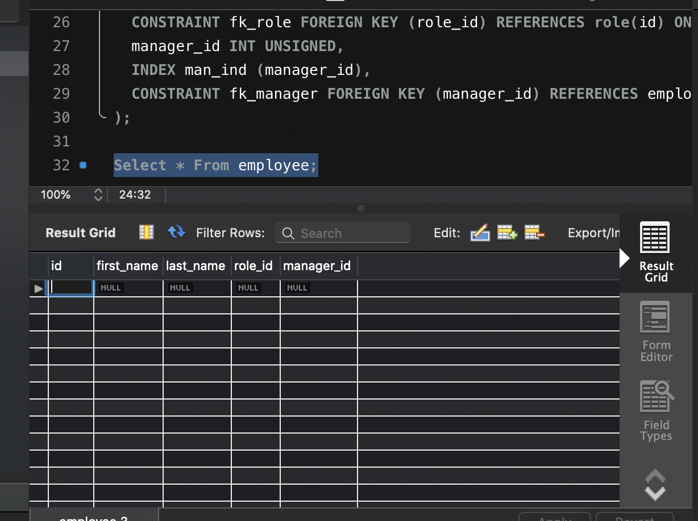
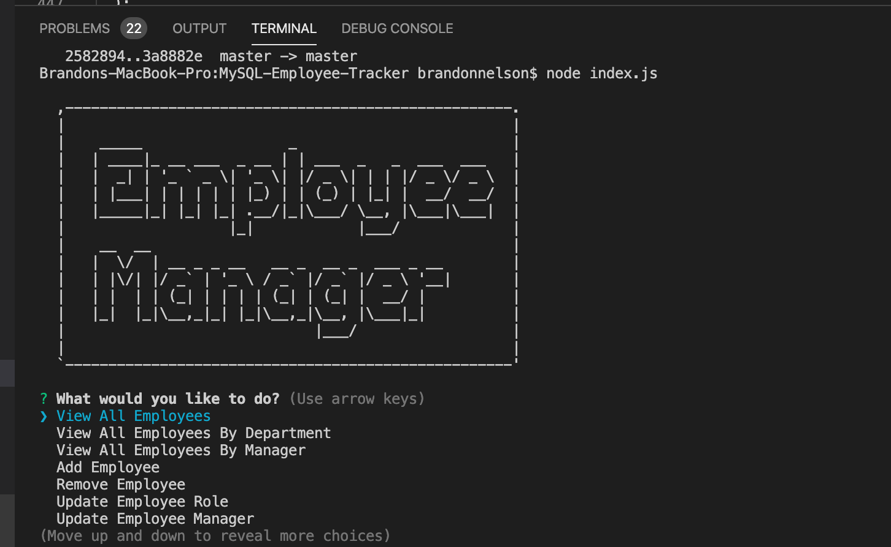

# MySQL-Employee-Tracker
## DU Full-Stack Development Homework 12: Employee Management System
## Brandon Nelson
## https://github.com/brandonln53/MySQL-Employee-Tracker

## User Story
As a business owner
I want to be able to view and manage the departments, roles, and employees in my company
so that I can organize and plan my business.

## Requirements

* Functional application.

* GitHub repository with a unique name and a README describing the project.

* The command-line application should allow users to:

  * Add departments, roles, employees

  * View departments, roles, employees

  * Update employee roles

## Screenshots

